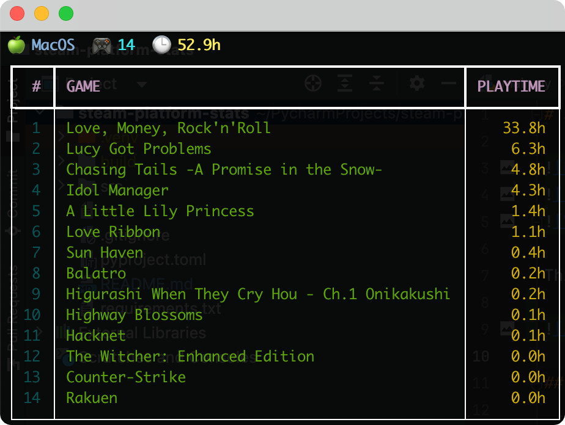

# steam-platform-stats


This little tool lets you check your Steam gaming stats by platform. Pick a platform, and it shows how many games you’ve played, total hours logged, and which games you’ve spent the most time on — and on which platform.



## Features

- Your Steam gaming stats for each platform (Windows, Mac, Linux, Steam Deck, or all).
- Clean table showing your played games and logged hours.
- Interactive mode via `fzf`.
- Some command-line options you can toy with (check out `steam-platform-stats --help`).
- Cached Steam API results for faster loading (~5 min TTL). Cache is stored in `~/.cache/steam-platform-stats/games.json`.
- Easy installation via `pipx` or `uv tool install`.

## Interactive Mode 
A dynamic `fzf`-powered view of your Steam library.

### Demo
[](https://asciinema.org/a/765579)

### What you can do
- Browse your Steam games with live filtering.
- Instantly switch between platforms.
- View detailed per-platform stats for any game in the separate window.
- See total playtime and game count for the current platform.

### Requirements
- `bash` (as the most common shell, Windows users can use WSL)
- `fzf` (must be installed and available in `$PATH`)

### Navigation and controls
| Key / Action | Description                                                                    |
|--------------|--------------------------------------------------------------------------------|
| `TAB`        | Switch to the next platform in the list (All, Windows, Linux, Mac, Steam Deck) |
| `CTRL-P`     | Open the platform selection menu                                               |
| `ESC`        | Exit interactive mode                                                          |
| `Enter`      | Open the game in your Steam Library                                            |


## Installation

1. First, clone the repo:
```bash
   git clone https://github.com/blackfan321/steam-platform-stats
   cd steam-platform-stats
```
   
2. Install the package:
   - Using `pipx`:

    ```bash
    pipx install .
    ```
    - Using `uv`:

   ```bash
   uv tool install .
   ```

3. Create the `.env` file:
    - Create the directory if it doesn't exist:
     ```bash
     mkdir -p ~/.config/steam-platform-stats
     ```

    - Create and edit the .env file:
     ```bash
     vim ~/.config/steam-platform-stats/.env
     ```
   
    - Add the following lines:
     ```bash
     STEAM_API_KEY='your_api_key_here'
     STEAM_ID=your_steam_id_here
     ```
    
    How to get these values:
    - `STEAM_API_KEY`: Register at [Steam Web API](https://steamcommunity.com/dev/apikey) to get your API key.
    - `STEAM_ID`: You can use [this site](https://steamid.xyz/): enter your profile URL, then copy obtained Steam64 ID and paste here.

4. (Optional) Enable autocompletion for zsh/bash:

- Install `argcomplete`:

    - Using `pipx`:

        ```bash
        pipx install argcomplete
        ```

    - Using `uv`:

        ```bash
        uv tool argcomplete
        ```

- Add the following line to your `.bashrc` or `.zshrc` file to enable autocompletion:

    ```bash
    eval "$(register-python-argcomplete steam-platform-stats)"
    ```

- Reload your shell configuration:

    ```bash
    source ~/.bashrc
    source ~/.zshrc
    ```

## Usage
```bash
steam-platform-stats [OPTIONS]
```

### General Options
- `-h`, `--help`  
  Show the help page.  

- `-p`, `--platform`  
  Choose the platform: `windows`, `mac`, `linux`, `deck`, or `all`.  
  **Example**: `--platform linux`

- `-l`, `--limit`  
  Limit the number of games shown in the table.  
  **Example**: `--limit 5`

- `--env-file-path`  
  Override the path to the .env file.  
  **Example**: `--env-file-path /some/path/.env`

### Filtering by Playtime
- `--min-playtime-minutes`  
  Filter displayed games by minimum playtime in minutes.  
  **Example**: `--min-playtime-minutes 120`

- `--min-playtime-hours`  
  Filter displayed games by minimum playtime in hours.  
  **Example**: `--min-playtime-hours 2.5`

### Output Options
- `--no-stats`  
Hide platform stats (only show games table).

- `--no-table`  
Hide the games table (only show platform stats).

- `--no-color`  
Disable colored output.

- `--fzf-table`  
  Render games table in fzf-friendly format (includes APPID, forces ANSI).

- `--game-stats`  
  Show detailed stats for a single game by APPID.  
  **Example**: `--game-stats 550`

### Interactive Mode
- `-i`, `--interactive`  
  Launch full-screen interactive mode using `fzf`.
