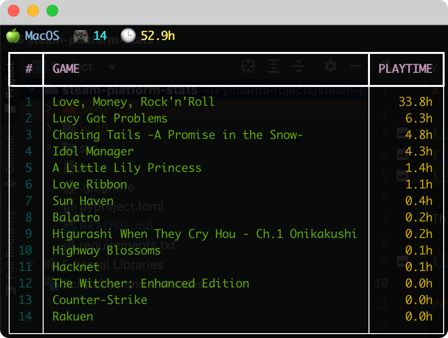

# steam-platform-stats


Browse your Steam playtime stats by platform in an interactive `fzf` UI — filter by name, switch platforms, and see per-game breakdowns.



## Features

- Interactive `fzf` browser for your Steam library.
- Per-platform stats (Windows, Mac, Linux, Steam Deck, or all).
- Live name filtering with matched game count and combined playtime.
- Per-game platform breakdown in the preview pane.
- Cached Steam API results (~5 min TTL) in `~/.cache/steam-platform-stats/games.json`.
- Easy installation via `pipx` or `uv tool install`.

## Requirements

- `bash`
- `fzf` ≥ 0.63
- `notify-send` (libnotify) — optional, for cache/API load notifications

## Demo

[](https://asciinema.org/a/765579)

## What you can do

- Browse your Steam games with live filtering (game name only; results keep playtime order).
- Instantly switch between platforms.
- View detailed per-platform stats for any game in the preview window.
- See total playtime and game count for the current platform.
- While filtering, see matched game count and combined playtime in the footer.
- `#` shows the game's playtime rank on the current platform.

## Navigation and controls

| Key / Action | Description                                                                    |
|--------------|--------------------------------------------------------------------------------|
| `TAB`        | Switch to the next platform in the list (All, Windows, Linux, Mac, Steam Deck) |
| `CTRL-P`     | Open the platform selection menu                                               |
| `ESC`        | Exit                                                                           |
| `Enter`      | Open the game in your Steam Library                                            |

## Installation

1. Clone the repo:
```bash
   git clone git@github.com:blackfan321/steam-platform-stats.git
   cd steam-platform-stats
```

2. Install the package:
   - Using `pipx`:

    ```bash
    pipx install .
    ```
    - Using `uv`:

   ```bash
   uv tool install .
   ```

3. Create the `.env` file:
    - Create the directory if it doesn't exist:
     ```bash
     mkdir -p ~/.config/steam-platform-stats
     ```

    - Create and edit the .env file:
     ```bash
     vim ~/.config/steam-platform-stats/.env
     ```

    - Add the following lines:
     ```bash
     STEAM_API_KEY='your_api_key_here'
     STEAM_ID=your_steam_id_here
     ```

    How to get these values:
    - `STEAM_API_KEY`: Register at [Steam Web API](https://steamcommunity.com/dev/apikey) to get your API key.
    - `STEAM_ID`: You can use [this site](https://steamid.xyz/): enter your profile URL, then copy obtained Steam64 ID and paste here.

## Usage

```bash
steam-platform-stats
```

Optional:

- `--env-file-path PATH` — override the path to the `.env` file.
